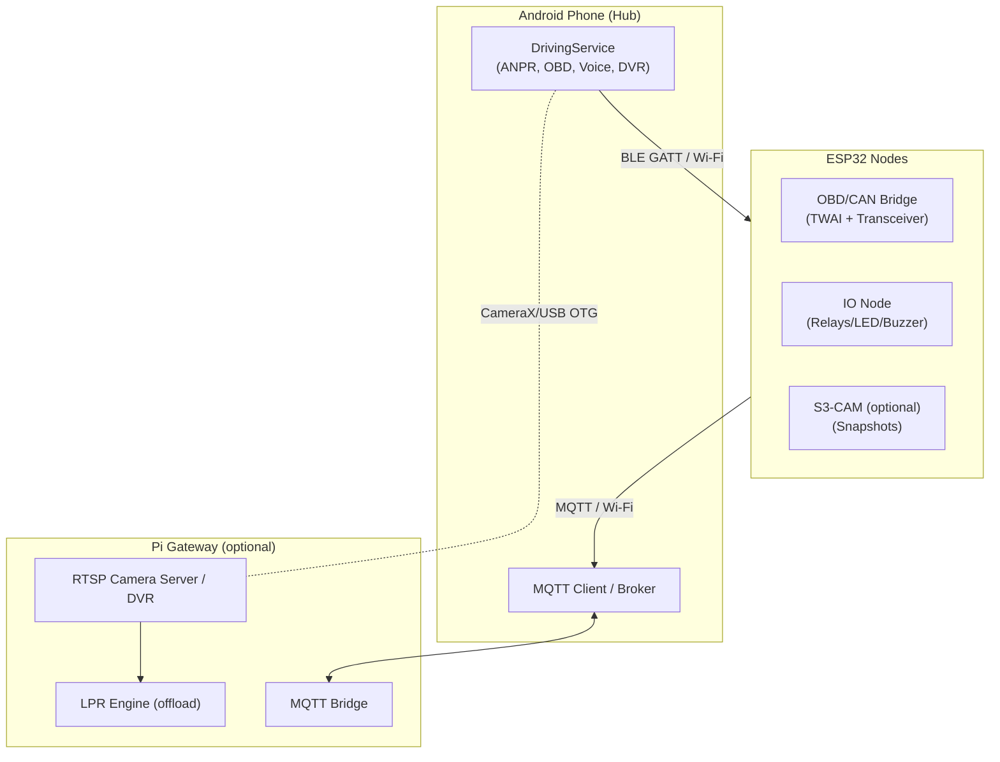

# Architecture Diagrams

## High-level System Architecture



## Data Flow (OBD → Alert)

```mermaid
sequenceDiagram
  participant ESP as ESP32 OBD Bridge
  participant AND as Android App
  participant RE as Rules Engine
  participant UI as Notifications/TTS

  ESP->>AND: BLE Notify Telemetry (fuel, rpm, temp)
  AND->>RE: Publish telemetry
  RE-->>AND: Evaluate predicates (fuel < 20%)
  AND->>UI: Show alert + TTS "Palivo dochází"
  AND->>MQTT: vehicle/alerts/{vin}
```

> Přidejte další diagramy (failover, discovery, pairing) dle potřeby.
