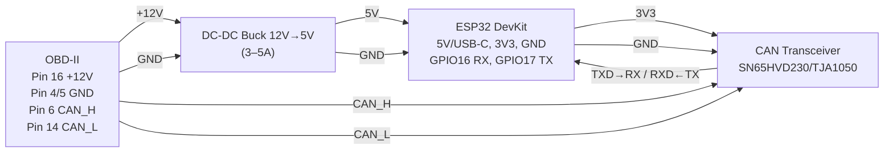

# Wiring & Power (OBD‑II/CAN)

## OBD‑II piny (CAN)
- Pin 6: CAN_H
- Pin 14: CAN_L
- Pin 4/5: GND
- Pin 16: +12V (nepřipojujte přímo na ESP32)

## ESP32 (TWAI) + transceiver
- SN65HVD230 TXD → ESP32 RX (GPIO16)
- SN65HVD230 RXD → ESP32 TX (GPIO17)
- VCC → 3V3, GND → GND
- CANH/L z OBD na transceiver CANH/CANL

## Napájení
- 12V → 5V buck (3–5A, automotive grade) → ESP32 5V/USB‑C
- Společná zem: OBD GND → buck GND → ESP32 GND → transceiver GND

## Parametry sběrnice
- Bitrate: 500 kbps, 11‑bit (EU po r. 2008)
- Terminace: auto již obsahuje, externí 120Ω nepřidávejte

## Bezpečnost
- Read‑only (listen‑only) při testování
- Pojistka 0.5–1A, twisted pair pro CAN vodiče, jediné GND místo

Detailní postupy a schémata viz instalační dokumenty a poznámky v `docs/misc/`.
